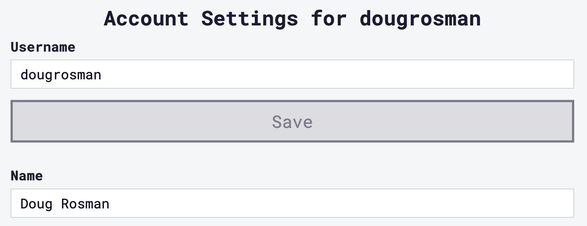
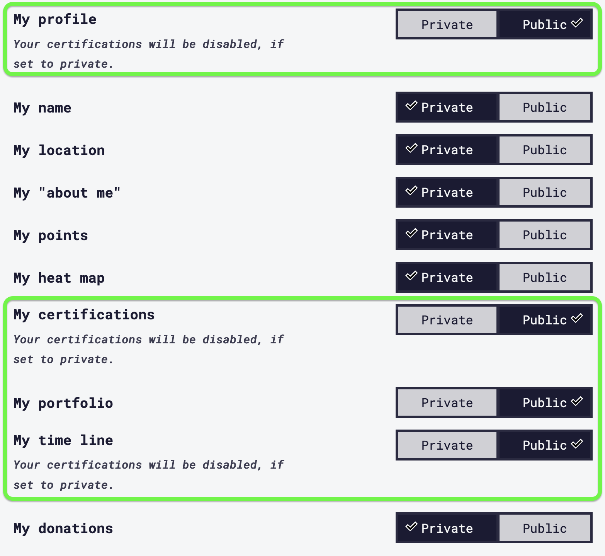
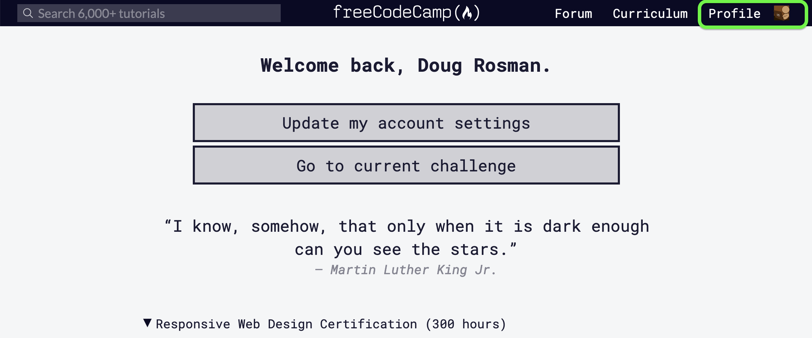
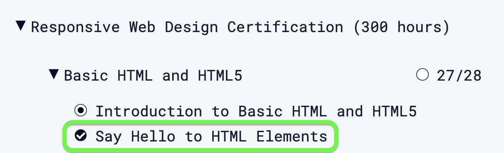
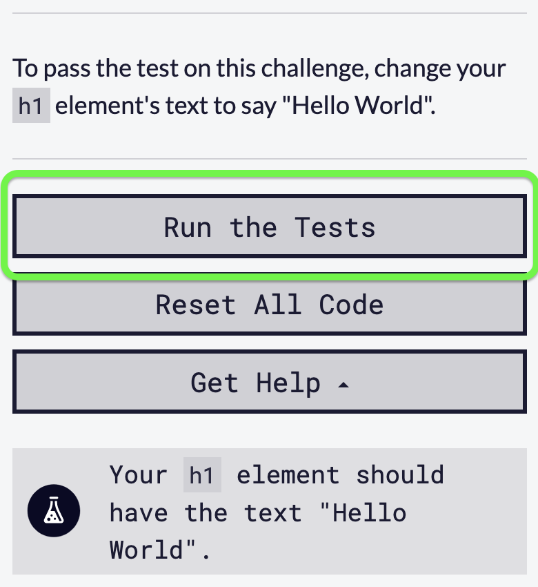

<a href="..">Home</a> 
<a href="guides">Back to Guides</a>

##### Webdev1 SP21

# Freecodecamp
Freecodecamp.org has a number of free coding tutorials we'll be using to practice our coding. This guide shows how to create an account, complete tutorials, and submit your progress to Canvas

## Creating an account
1. Go to freecodecamp.org
2. Click 'Sign In' in the top right
3. Click 'Continue with GitHub'. (If you don't have a GitHub account, follow the GitHub setup guide [here](github.md)).
4. Click the 'Profile' button in the top right.
5. Click [Update my Account Settings](https://www.freecodecamp.org/settings)
6. Set your username to your preferred name and last name. For example, my name is **Doug Rosman**, my user name is **dougrosman**.

7. Click 'Save'
8. Scroll down, and set the following items to 'public' (profile, certifcations, portfolio and timeline)

9. You can find the link to your profile here:

**Your profile should look like this: https://freecodecamp.org/dougrosman. That is the link you will submit to Canvas so I can see your progress.**

## Completing a tutorial

1. From the [Freecodecamp Learn page](https://www.freecodecamp.org/learn), click the tutorial you want to start with.

2. Read the left panel to learn about the new concept. The instructions for how to complete the the challenge will be towards the bottom.
3. Type your code solution in the center panel.
4. Once finished, click 'Run the Tests'. If your code is correct, you can move onto the next challenge.

### Freecodecamp tips and strategies

* Freecodecamp isn't perfect! Sometimes it has bugs. If you are pretty sure your code is correct, but Freecodecamp keeps saying there's an error, don't spend too long trying to fix it. Take a screenshot of your code and email it to me with a question, then move onto the next challenge.
* If you're totally suck on a challenge, move onto the next one. Once you've attempted all the assigned tutorials, go back to the beginning and retry the ones you skipped; the answer might just come to you the second time!
* If you're still stuck on some tutorials, take a break and come back later.

