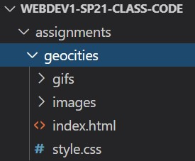

# GeoCities "Web 1.0" 

## **Summary**
Create your own web page based in the Web 1.0 aesthetics encapsulated by websites hosted on GeoCities. Use Cameron's World ([cameronsworld.net](https://www.cameronsworld.net/)) as a place to find inspiration.

## **Guidelines**
This is an open-ended assignment with some minimum technical requirements. Have fun with this one! There's no upper limit on the content you want to include in your site; Web 1.0 sites like this are often filled with bright, colorful content that.

### **Requirements**
1. Include at least **3 images** and **3 animated GIFs** (that means a minimum of **6 `` tags**) (You can find gifs on [gifcities.org](https://gifcities.org))
2. Include at **1 background image** (Background images are set in your CSS using the `background-image: url("yourimage.jpg")`) property. (Note, background images can be still images or animated GIFs)
3. Use a combination of `position: absolute;` and `position: fixed;` to position your elements
4. Use at least **2 different font families** using the `font-family: your-font;` property.
5. Your website should be publicly accessible on your GitHub pages website (you'll need to do this to turn the assignment in anyway).

### **Setup**
1. Inside your **assignments** folder in your webdev1 repo, create a folder called **geocities**. Your file/folder structure should look like this:
   
2. Make sure your `style.css` file is link to your `index.html` file in the `<head>` section.
3. Make sure all your images/gif files are renamed to have no spaces and lowercase letters only

### **How to get full credit**
1. Complete all minimum technical requirements
2. Make sure your code does not have any errors (I will be using an HTML validator when I grade this, so make sure you run your code through a validator before submitting it!)
3. Make sure your code is neat/indented nicely
4. The link you submit to Canvas should be correct.

### **How to submit**
Push your changes to GitHub, and submit the correct link to this assignment. If you need a refresher on how to do that, you can revist the video I created for CSS Basics assignment. I suggest [starting the video at 11:11](https://www.youtube.com/watch?v=88QYmFPqAkA&t=671s)