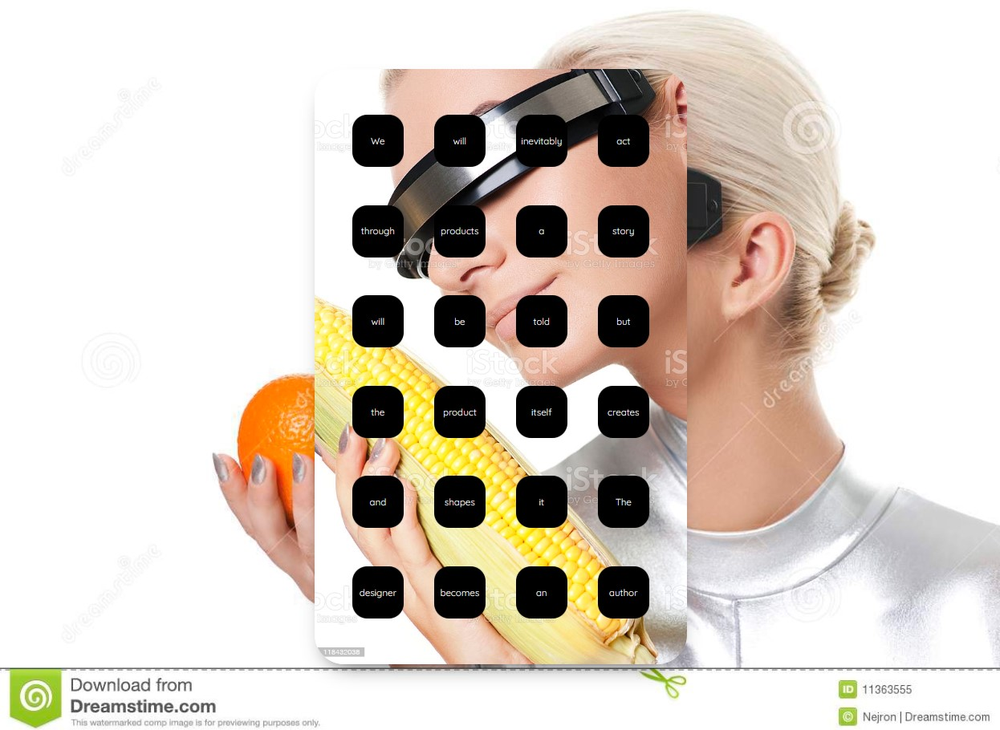

# "Smartphone"

## **Summary:**
Simulate a "smartphone" in your browser using CSS Flex. This is a more difficult assignment, you have 2 weeks to complete it.

<video src="videos/smartphone.mp4" width="1280" autoplay muted loop controls></video>

## **Background**
Recalling Olia Lialina's essay [Rich User Experience, UX and Desktopization of War](http://contemporary-home-computing.org/RUE/), this assignment evokes the shift from web 1.0 "DIY" aesthetics to web 2.0 grid-based layouts and app-centric design. In the earlier days of smartphones, mobile apps and websites inherited their aesthetics from their larger desktop counterparts. Now, with the majority of people accessing the Internet on their phones, web pages are often designed mobile-first. This "smartphone in the browser" assignment represents a closing of the design loop: the idea of a browser as just a place to interact with a larger version of a phone.

## **Assignment goals:**

  * Become comfortable with CSS Flexbox
  * Know when to use flex-direction: column; and flex-direction: row;
  * Know the difference between justify-content and align-items when switching flex directions.

## **How to get full credit:**
**For each of these that is not satisfied, I will take off 1 point**

  1. Use CSS flexbox (`display: flex;`) to visually organize a set of "apps"
  2. Design your phone in "portrait" mode.
  3. Minimum rows: 5 (feel free to include more)
  4. Minimum columns: 4 (feel free to include more)
  5. Each app should link to something (aka, each app should be an `<a>` (anchor tag))
  6. Your entire phone should be centered on the page horizontally & vertically. This can be achieved in a number of ways
  7. Each "app" should have a unique piece of content. This can be a different color, an image, some text, a GIF, a gradient. As long as its different for each app. (hint: instead of using an `` tag, apply a `background-image: url("bg_img.jpg");` to your apps)
  8. Each "app" should have a hover effect (it can be the same effect for each app)
  9. Your phone should be responsive! (meaning, your phone should resize itself when you change your screen size)
  10. You should have 1 html file called `index.html`
  11. You should have 1 css file called `style.css`
  12. Your HTML have 0 errors when run through this [HTML Validator](https://validator.w3.org/#validate_by_input).
  13. Your CSS should have 0 errors when run through this [CSS Validator](https://validator.w3.org/nu/#textarea) (make sure to check the box next to CSS).
  14. The link you submit to the Canvas assignment correctly takes me to your web page. *Make sure to test your link before submitting it.*

## **Setup**
1. Inside your **assignments** folder in your webdev1 repo, create a folder called **smartphone**.
2. Inside that folder, create your `index.html` and `style.css` files.
3. Make sure your `style.css` file is link to your `index.html` file in the `<head>` section.
4. Make sure all your image files are renamed to have no spaces and lowercase letters only
5. 

## How to submit:

  Submit the URL to your GitHub Pages website for your smartphone page. Your URL will probably look something like this: https://dougrosman.github.io/webdev1/assignments/smartphone.

## Tips + Resources:

  1. Sketch out your phone wireframe before coding. Try figuring out how many `<divs>` you'll need before coding.
  2. Try writing all your HTML structure first, then editing your CSS to  make it look how you want.
  3. If you're using images for your apps, you can use the `background-image` property. `background-image: url("url-for-your-image");` Here are some helpful properties for sizing your background images:
     1. `background-size: contain;` (your image will maintain its aspect ratio and fit inside its parent container
     2. `background-size: cover;` (your image will maintain its aspect ratio but will make sure it covers the entire parent container. Your image will be cropped automatically if you do this.
     3. `background-repeat: no-repeat;` put this if you don't want your images to repeat.
  4. 
    

Closing thoughts:

1. You don't have to make your "smartphone" look like the examples below. You can make them totally weird. Have fun with it. As long as you meet the requirements listed above, the rest is up to you.
2. The last example below contains hints for how to structure your HTML. If you want to challenge yourself to do all this from scratch, don't look at the 4th example image ;)
3. [cssgradient.io](https://cssgradient.io/): Generate background Gradients
 

Note: The above example image uses something called "pseudo elements", specifically the ::before pseudo element. This made it very easy to add the same "notification" accent in the corner of each app. If you're curious about using pseudo elements, check out this video: Before and After pseudo elements explained - part one: how they work (Links to an external site.)

