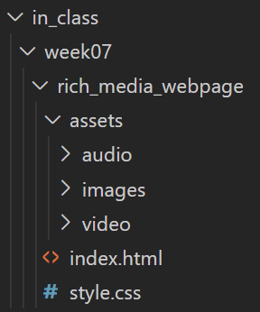

# Webdev1 - Week 6 - 03/08/21
## CSS Flexbox part 2, images, video, audio. Background Images, Google Fonts, Hover effects, box shadow, border vs. outline

## Agenda
### Part I: Getting Started
#### 1. Hellos
   1. Close other apps
   2. Look over your comments/grades
      1. Late policy reminder: Assignments more than a week old can still be turned in for up to 5 points.
   3. Ask questions
   4. Office hours this week (Thursday, 03/11, 5pm-6:30pm). This time slot is open to both sections, so you may see students in other sections, but we're all working on the same material!
   5. Revisit the HTML Validator
   6. Extra credit is due

### Part II: Review
#### 0. Review last week's concepts
  1. Centering in CSS
  2. CSS positioning
  3. CSS box model
  4. CSS Flexbox

### Part III: New concepts
#### 1. Setup
   1. Open your webdev1 repo inside VS Code
   2. Inside your in_class folder, create a folder called week07 with the following folder structure:
   3. ]
   4. After setting up your folder and files in VS Code, [download these sample placeholder assets](doug_assets.zip) and drag and drop them into your own folders in VS Code
 
#### 2. CSS Flexbox Continued (child properties)
*[A Complete Gudie to Flexbox (CSS Tricks)](https://css-tricks.com/snippets/css/a-guide-to-flexbox/)*
   1. `flex: <grow> | <shrink> | <basis>`

#### 3. Media
   1. Images (``)
      1. [picsum.photos](https://picsum.photos/): Fast and easy placeholder images!
      2. Writing `alt text`
      3. `object-fit: contain;`
   2. Video (`<video>`)
   3. Audio (`<audio>`)

#### 5. background images
   1. `background-repeat: no-repeat;`;
   2. `background-size: cover;`;
   3. `background-size: contain;`;

#### 6. hover effects
   1. `.your-element:hover {background: orange;}`

#### 7. Box-shadow
   1. `box-shadow: 5px 5px 20px 2px black`

#### 8. Outline vs. border
   1. `border: 2px solid green;` (border is part of the box model, and takes up space in the document flow)
   2. `outline: 2px solid pink` (outline is not part of the box model, and doesn't take up space in the document flow. It is only visual)
   3. `box-sizing: border-box;` (turning this on means that the border and padding on an element will be included in their total width, and not add extra with to the element)

#### 9. Google Fonts
   1. https://fonts.google.com/

### Part IV: Homework
   1. 6a: [Smartphone assignment](assignment06): Simulate a smartphone in your web page using Flexbox to align your items.
    