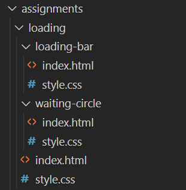
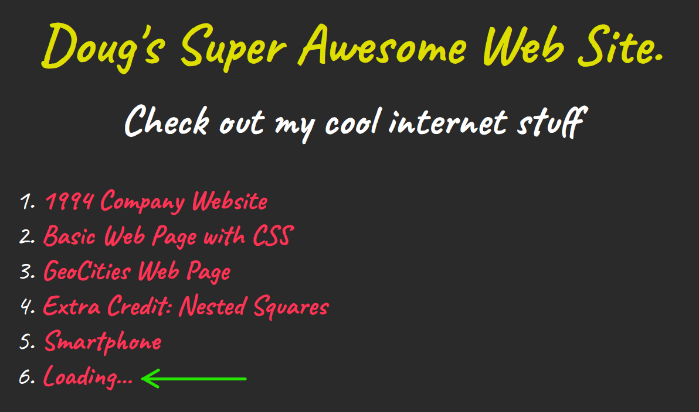
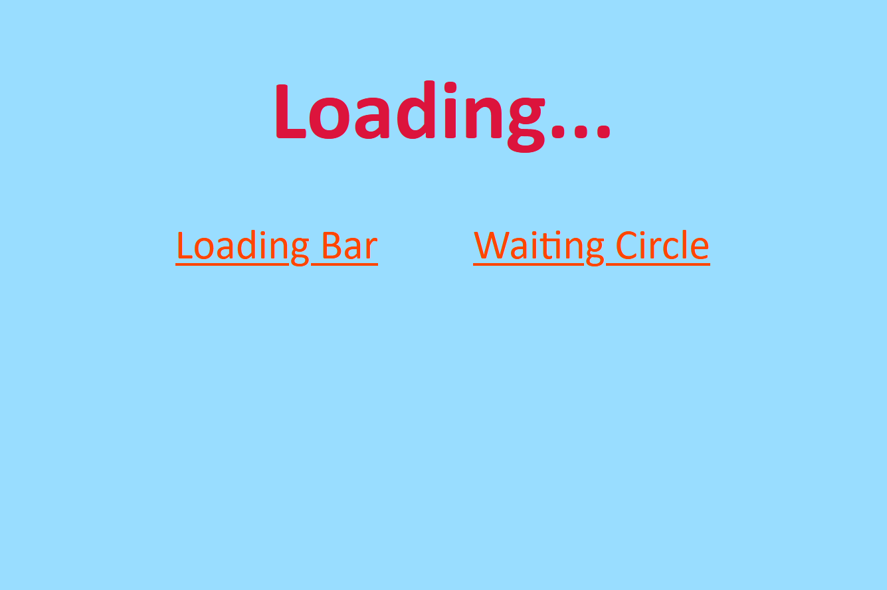

**Due: March 29, 12:30pm**

## **Summary**
Using CSS animations, create two animated pieces of content: a "loading bar" and a "waiting circle." Each animation should have its own page.

For some inspiration, check out this subreddit: [r/loadingicon](https://www.reddit.com/r/loadingicon/). Note, most of these would be considered "waiting circles", since they loop infinitely. Also, some of these are pretty complex, and probably aren't done using CSS animations. I've included this page to demonstrate that a "waiting circle" or a "loading bar" can look like anything, really. They don't need a literal "bar" or "circle". They just need to communicate the passing of time, or the accumulation of progress.

## **Learning goals**
Practice creating content with CSS Animations.

## **Guidelines**

### Create 3 separate web pages:

1. A web page with your loading animation
   1. I define as **an animation that has a start and end point, and does NOT loop infinitely.**
2. A web page with your "waiting" animation
   1. I define a "waiting" animation as **an animation that loops infinitely.**
3. A web page ("hub" page) that links to both of the above pages.
   1. This page should have some CSS styling.
   2. As with the other assignments in your WebDev1 portfolio, you should include a link to this page on your WebDev1 Portfolio Home page.

## **Setup**

## **How to get full credit**

### For each of these that is not satisfied, I will take off 1 point:

1. Your WebDev1 Portfolio page should have a link to your Loading Assignment "hub" page.
2. Your Loading Assignment "hub" page should have a link to your **loading bar** and a link to your **waiting circle**
3. Your **Loading Bar** should...
   1. Include a CSS animation with a starting state and an ending state (it shouldn't loop)
   2. The starting state should be different from the ending state
4. Your **Waiting Circle** should...
   1. Include a CSS animation that loops infinitely
5. Your links should all work
6. The link you submit to Canvas should be the correct link
7. Your HTML and CSS should be error-free.
8. Your code should be properly indented.

  

## **How to submit**

Submit the URL to your WebDev1 Portfolio Home Page. Your URL will probably look something like this: https://dougrosman.github.io/webdev1/. I will use that page to find your Loading... Assignment.